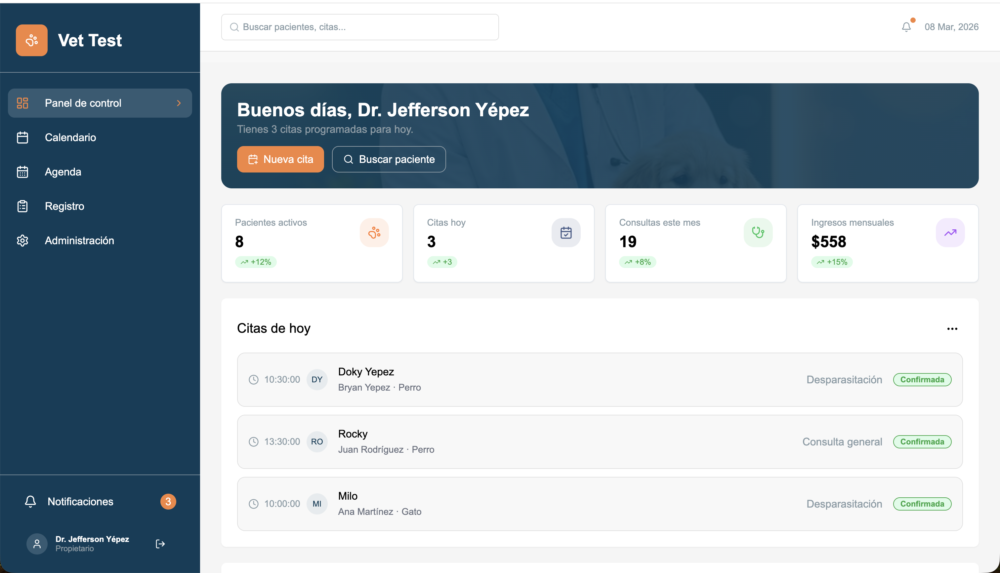

# VetAdmin

Sistema de gestión para clínicas veterinarias desarrollado con tecnologías modernas de frontend y backend.  
La plataforma permite administrar pacientes, citas, servicios veterinarios y clientes desde una interfaz moderna e intuitiva.

VetAdmin está diseñado para optimizar la gestión administrativa de clínicas veterinarias y mejorar la eficiencia en el cuidado animal.

---

## Tecnologías Utilizadas

### Frontend

- React 19
- Vite
- React Router DOM v7
- TanStack Query (React Query)
- Radix UI
- Lucide React
- React Hot Toast
- CSS Modular

### Backend

- Supabase
- PostgreSQL
- Row Level Security (RLS)

---

## Características

- Gestión de pacientes
- Gestión de clientes
- Sistema de citas veterinarias
- Panel administrativo
- Interfaz moderna y responsiva
- Manejo eficiente de estados con React Query
- Arquitectura modular escalable

---

## Acceso de prueba

Para probar la plataforma puedes usar las siguientes credenciales:

Email

```
vettest@mail.com
```

Contraseña

```
Hola_123
```

---

## Instalación

Clonar el repositorio

```
git clone https://github.com/Ypz22/VetAdmin.git
cd VetAdmin
```

Instalar dependencias

```
npm install
```

Configurar variables de entorno

Crear archivo .env
```
VITE_SUPABASE_URL=your_supabase_url
VITE_SUPABASE_ANON_KEY=your_supabase_key
```

Ejecutar el proyecto
```
npm run dev
Scripts disponibles
```
Ejecutar servidor de desarrollo
```
npm run dev
```
Construir versión de producción
```
npm run build
```
Previsualizar build
```
npm run preview
```

Estructura del Proyecto
src
 ├── api
 │   └── llamadas directas a Supabase
 │
 ├── components
 │   └── componentes reutilizables
 │
 ├── config
 │   └── configuración de Supabase
 │
 ├── hooks
 │   └── custom hooks de React
 │
 ├── pages
 │   └── páginas principales de la aplicación
 │
 ├── queries
 │   └── hooks de TanStack Query
 │
 ├── styles
 │   └── estilos globales
 │
 └── utils
     └── funciones auxiliares
Arquitectura

VetAdmin utiliza una arquitectura basada en:

React para la interfaz

Supabase como backend BaaS

TanStack Query para manejo de datos remotos

Componentes desacoplados y reutilizables

Esto permite mantener el código modular y escalable.

Roadmap

Futuras mejoras del sistema

Dashboard con métricas

Sistema de notificaciones

Historial médico completo

Gestión de inventario veterinario

Soporte multi clínica

Autor

Jefferson Yepez
Estudiante de Ingeniería en Software

Licencia

Este proyecto es privado y no está disponible para distribución pública.


## Preview

### Dashboard



### Patients


