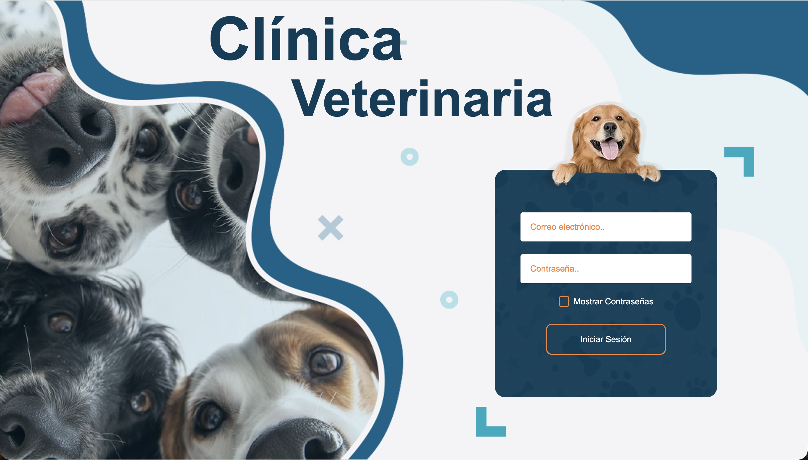
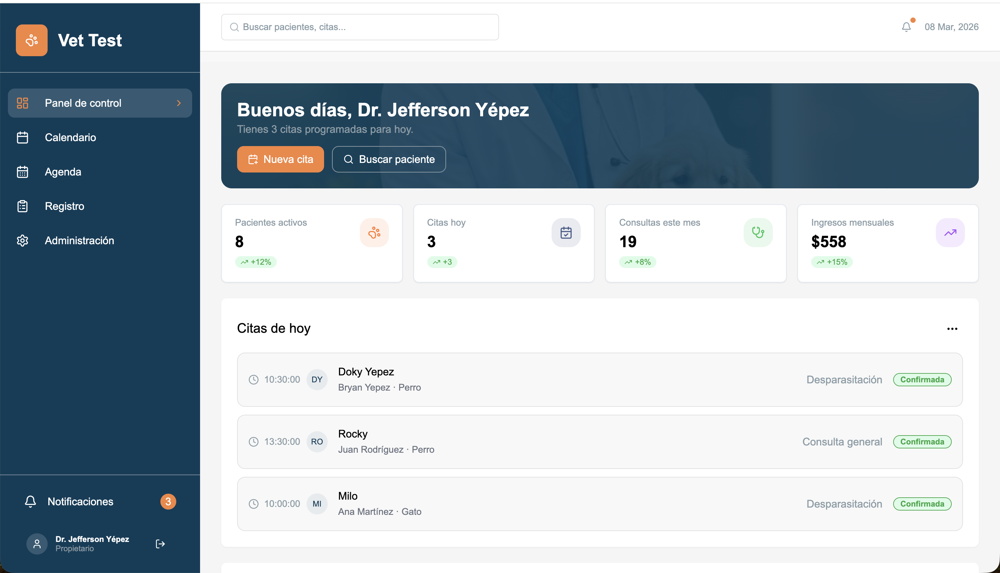
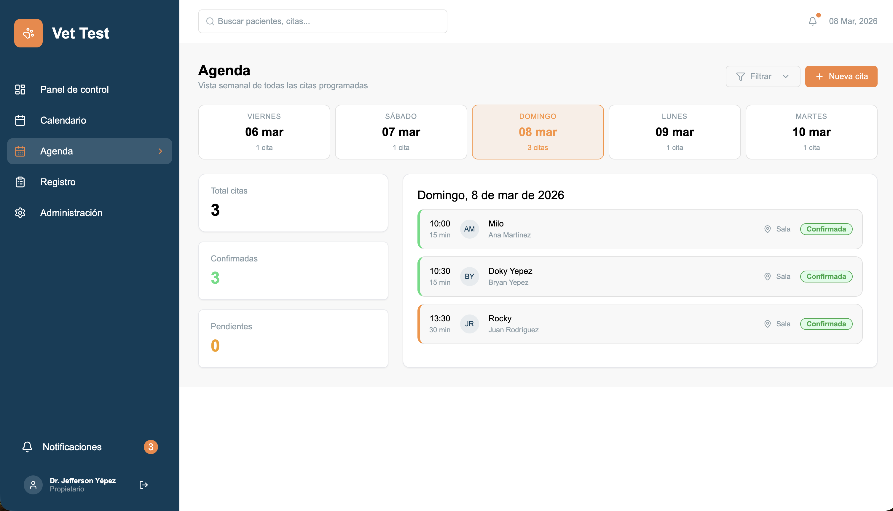
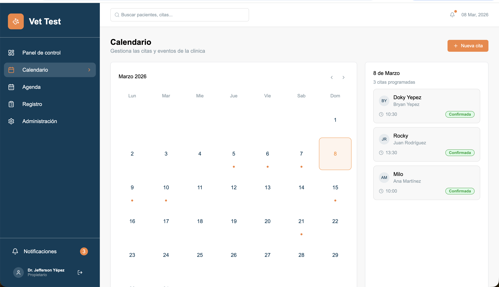
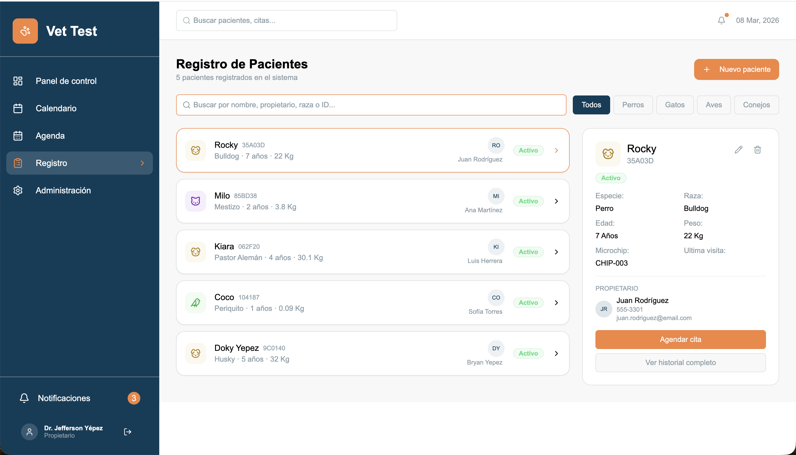
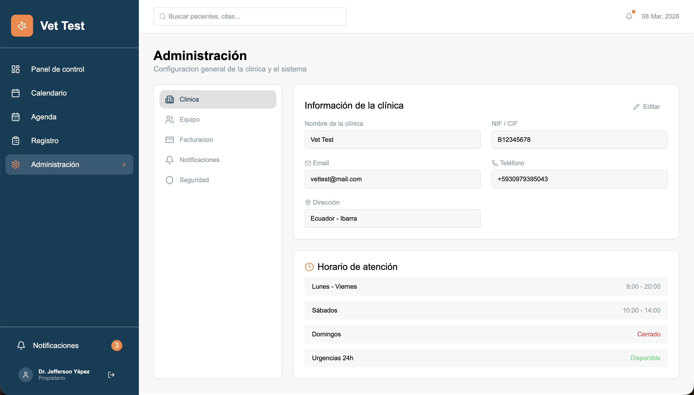

# VetAdmin

Live demo: [vet-admin-git-main-ypz22s-projects.vercel.app](https://vet-admin-git-main-ypz22s-projects.vercel.app/)


VetAdmin is a veterinary clinic management web application built to centralize patients, clients, appointments, services, and internal administration in a single interface.

The project focuses on day-to-day operational workflows for veterinary teams, combining a responsive React frontend with Supabase for authentication, database access, and secure multi-user data handling.

## Overview

VetAdmin helps veterinary clinics:

- manage pet records and client information
- organize appointments and availability
- control services and internal team data
- keep administrative workflows clear and easy to use

The application was designed with a modular frontend architecture so new features can be added without turning the codebase into a monolith.

## Main Features

- Authentication with Supabase Auth
- Patient registration and record management
- Client registration and contact management
- Appointment creation, editing, and status tracking
- Weekly agenda and calendar views
- Service management with duration, pricing, and availability
- Team administration through Supabase Edge Functions
- Appointment response flow through email-driven actions
- Responsive dashboard experience for clinic staff

## Tech Stack

### Frontend

- React 19
- Vite
- React Router DOM v7
- TanStack Query
- Radix UI
- Lucide React
- React Hot Toast
- Modular CSS

### Backend and Data

- Supabase
- PostgreSQL
- Supabase Auth
- Row Level Security (RLS)
- Supabase Edge Functions

## Demo Access

You can explore the live demo with the following credentials:

- Email: `vettest@mail.com`
- Password: `Hola_123`

## Screenshots

### Login



### Dashboard



### Agenda



### Calendar



### Register



### Admin



## Project Structure

```text
src
├── api             # Direct access to Supabase tables and Edge Functions
├── components      # Reusable UI building blocks
├── config          # Shared configuration such as the Supabase client
├── constants       # Static app-level values
├── hooks           # Custom React hooks
├── pages           # Route-level views and feature sections
├── queries         # TanStack Query wrappers for data access
├── styles          # Shared component styles
├── utils           # Helper functions and formatting utilities
└── assets          # Images and static visual resources
```

## Application Modules

The current application includes these main areas:

- `Home`: dashboard-style landing area after login
- `Register`: patient and client registration flows
- `Agenda`: weekly appointment management with filters and pagination
- `Calendar`: calendar-oriented appointment visualization
- `Admin`: clinic, team, billing, notification, and security settings
- `Appointment Response`: public response flow for confirming or cancelling appointments

## Architecture Notes

VetAdmin follows a frontend-first modular structure:

- `api/` contains raw data access functions
- `queries/` wraps those APIs with TanStack Query for caching and async state
- `hooks/` concentrates reusable behavioral logic
- `components/` keeps the UI reusable and easier to scale

This separation helps keep the project maintainable as more clinical and administrative features are added.

## Local Setup

### 1. Clone the repository

```bash
git clone https://github.com/Ypz22/VetAdmin.git
cd VetAdmin
```

### 2. Install dependencies

```bash
npm install
```

### 3. Configure environment variables

Create a `.env` file in the project root:

```env
VITE_SUPABASE_URL=your_supabase_url
VITE_SUPABASE_ANON_KEY=your_supabase_anon_key
```

### 4. Start the development server

```bash
npm run dev
```

The app will be available at the local Vite development URL, typically `http://localhost:5173`.

## Supabase Requirements

To run the full project correctly, your Supabase project should provide:

- authentication configured for the app users
- PostgreSQL tables for patients, clients, appointments, services, profiles, team data, and clinic-related entities
- Row Level Security policies aligned with veterinary ownership and staff roles
- the following Edge Functions used by the app:
  - `send-appointment-email`
  - `respond-appointment`
  - `manage-team-members`

Without those Edge Functions, some flows will still load, but appointment email handling and team management features will not work as expected.

## Available Scripts

```bash
npm run dev      # Start development server
npm run build    # Build production version
npm run preview  # Preview production build
npm run lint     # Run ESLint
```

## Why This Project Stands Out

What makes VetAdmin stronger than a basic CRUD demo:

- real administrative workflow orientation instead of isolated forms
- server-state management with TanStack Query
- Supabase Auth plus RLS-based access control
- Edge Function integration for operational flows
- modular code organization ready for future scaling

## Roadmap

Potential next improvements:

- medical history timeline per patient
- inventory and medication tracking
- analytics dashboard with operational metrics
- notification center for staff and appointment reminders
- multi-clinic support

## Author

Jefferson Yepez  
Software Engineering Student

## License

This project is private and not intended for public redistribution.
